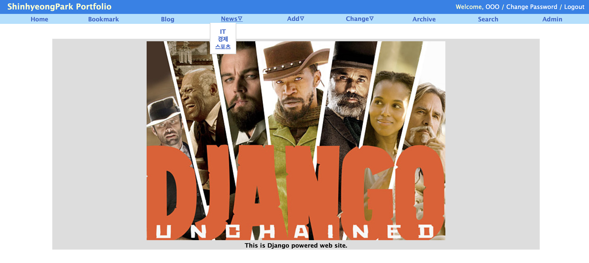
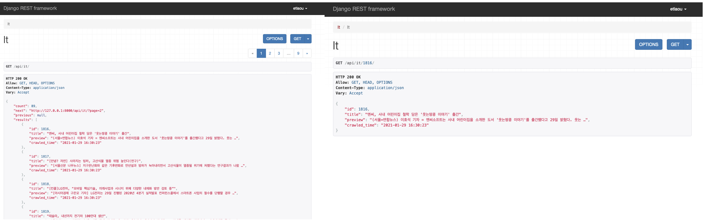
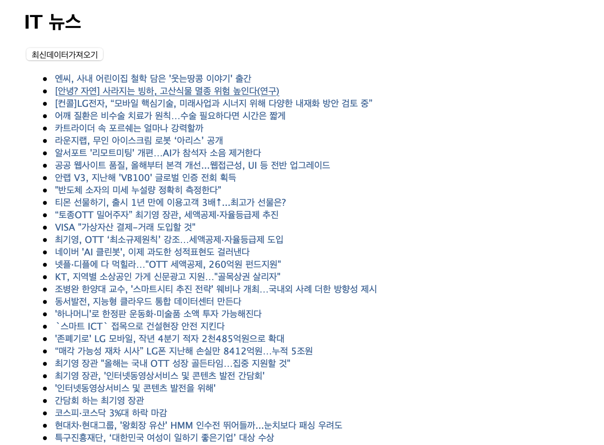
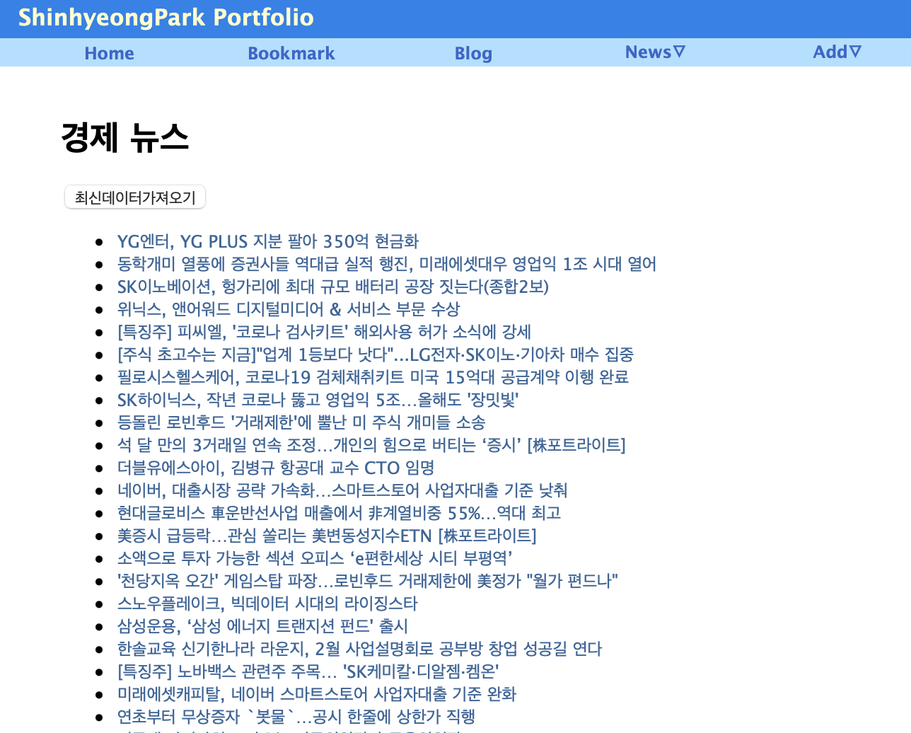

# Django Web Project
> 개인프로젝트

## issue
> - 왜 Flask가 아닌 Django를 선택했나?
>   : 장고가 더 무겁지만 DB(MySQL), restframework를 사용하기 위해서
>     또한 웹프레임워크에 익숙해지기 위한 프로젝트이므로 API서버를 구현하기 위해 선택

## Blog Web
> 네이버 뉴스 데이터를 크롤링하여 리스트 형식으로 보여주고, 데이터 검색이 가능한 장고 웹 프로젝트  
> 사이트에 존재하는 데이터를 제공하는 Restful API로 설계 및  구현  

## Function
1. News Crawling
	- IT
	- 경제
	- 스포츠
2. Search Keyword
3. Select Post
	- Blog
	- Bookmark
4. REST API

## Directory Tree
```
.
├── ITscrapper 		#IT 뉴스 크롤링 봇
├── Sportsscrapper 	#스포츠 뉴스 크롤링 봇
├── api 		#크롤링 데이터 REST API
├── blog 		#게시물
├── bookmark 		#북마크
├── data 		#크롤링 데이터 리스트
├── db.sqlite3 		#Database
├── manage.py		#Django 실행
├── mysite_base 	#메인 화면
├── scrapper 		#경제 뉴스 크롤링 봇
├── static 		#CSS파일
├── templates 		#HTML파일
└── venv 		#가상머신
```

## Pip List
```
Python 			3.9.1
Djanog(Framework) 	3.1.5
Scrapy 			2.4.1
djangorestframework 	3.12.2
setuptools          	49.2.1
Database		sqlite
```

## How to Run?
```
#가상환경 실행
source venv/bin/activate
#서버 실행
python3 manage.py runserver
```

## API
```
#게시물
GET http://localhost[PORT]/api/posts

#IT 뉴스
GET http://localhost[PORT]/api/it

#경제 뉴스
GET http://localhost[PORT]/api/eco

#스포츠 뉴스
GET http://localhost[PORT]/api/sports
```

## How to Use Docker Image
```
#Push Image
docker push orpsh1941/mydjango:tagname
#Run Container
docker run -d -p 8000:8000 --name mydjango mydjango:latest
```

## docker-compose yml
> 장고 Application과 Server를 같은 네트워크로 연동
```
version: "3.9"
services: 
  my-mysql:
    container_name: mysql_server
    image: edowon0623/mymysql:1.2
    ports: 
      - 3306:3306
  my-django:
    container_name: django_server
    image: edowon0623/mydjango
    ports:
      - 8000:8000
    depends_on: 
      - my-mysql
    networks:
      - my-network
networks:
  my-network:
```

## Screen
### News: Main

### REST API

### News: IT

### News: ECO



